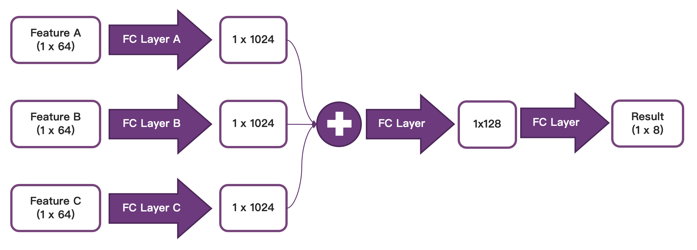

# WDmC: W(afer)D(efect)m(odes)C(lassifier)

Machine Learning & Big Data (2022 Fall) Final Project: Wafer Defect modes Classifier

**Assert!!!** To keep data confidential, we _**do not**_ upload the dataset file, please go to the [THU Web Learning](https://learn.tsinghua.edu.cn) to download the dataset by yourself.

## Envs

```
python==3.7
torch==1.8.0
torchvision==0.9.0
numpy==1.21.6
matplotlib==3.5.3
tensorboard==2.11.0
tqdm==4.64.1
colorlog==6.7.0
```

Create a python3.7 environment and run:

```
pip install -r requirements.txt
```

to install these packages in your environment.

---

_If you have some problems when installing `PyTorch`, these informations may help you._

To install `PyTorch(CPU)`, using: `pip install torch==1.8.0+cpu torchvision==0.9.0+cpu torchaudio==0.8.0 -f https://download.pytorch.org/whl/torch_stable.html`.

To install `PyTorch(GPU)`, you need to know the CUDA Version by using `nvcc -V`, we recommand `CUDA10.1` and `CUDA11.1`, other version may failure when installing, you can install CPU Version instead:

- `CUDA10.1`: `pip install torch==1.8.0+cu101 torchvision==0.9.0+cu101 torchaudio==0.8.0 -f https://download.pytorch.org/whl/torch_stable.html`
- `CUDA11.1`: `pip install torch==1.8.0+cu111 torchvision==0.9.0+cu111 torchaudio==0.8.0 -f https://download.pytorch.org/whl/torch_stable.html`

## Usage

1. Make sure all path are exist, if not, create it:

```
mkdir data && cd data && mkdir processed && mkdir raw && mkdir result && cd ..
mkdir weights && mkdir runs
```

Update: the program can create the dir automatically.

2. Download `datasets2022.npz` and put it in `./data/raw/`

3. Train a model:

```
usage: run.py [-h] [--target TARGET] [--stage STAGE] [--rawpath RAWPATH]
              [--newpath NEWPATH] [--datadir DATADIR] [--trainscl TRAINSCL]
              [--bts BTS] [--lr LR] [--initmodel INITMODEL] [--loadwt LOADWT]
              [--weightsroot WEIGHTSROOT] [--weights WEIGHTS] [--model MODEL]
              [--saveweights SAVEWEIGHTS] [--dataset DATASET] [--epoch EPOCH]
              [--optim OPTIM] [--result RESULT] [--final FINAL]

optional arguments:
  -h, --help            show this help message and exit
  --target TARGET       train or eval
  --stage STAGE         project stage, self/raw-train/final-test
  --rawpath RAWPATH     raw dataset path
  --newpath NEWPATH     new dataset path
  --datadir DATADIR     processed dataset path
  --trainscl TRAINSCL   train dataset scale
  --bts BTS             batch size
  --lr LR               learning rate
  --initmodel INITMODEL
                        init the model weights (True/False)
  --loadwt LOADWT       load model weights (True/False)
  --weightsroot WEIGHTSROOT
                        load model weights root path
  --weights WEIGHTS     load model weights path
  --model MODEL         model type (xvgg16/xresnet50/xvit)
  --saveweights SAVEWEIGHTS
                        save model weights path
  --dataset DATASET     using dataset
  --epoch EPOCH         epoch num
  --optim OPTIM         optimizer (adam or sgd)
  --result RESULT       result file path
  --final FINAL         is the last one (True/False)
```

or run the script directly:

```
bash run.sh
```

4. Eval the model:

```
python -u run.py --target eval --initmodel False --loadwt True --weightsroot ./weights --weights model-full-final-2.pth --model neck
```

or get the result file (.csv):

```
python -u run.py --target eval --stage final-test --initmodel False --loadwt True --weightsroot ./weights --weights model-full-final-2.pth --model neck --result ./data/result/Group5.csv
```

We provide a trained model weights here: https://github.com/keyork/WDmC/releases/tag/v2.0.0

Download and put it in `./weights/`, then run this eval project.

## Eval

- `ACC`: `98.6191%`
- `AverageHammingDistance`: `0.002199`

## Our Model

We train three different models independently, and use a neck model to combine them.


### Transform

- Transform 1
  - train
    - RandomHorizontalFlip, p=0.4
    - RandomVerticalFlip, p=0.4
    - RandomRotation, degree=45
    - Normalize, mean=0.5, std=0.5
  - test
    - Normalize, mean=0.5, std=0.5
- Transform 2
  - train
    - Resize -> (224,224)
    - RandomHorizontalFlip, p=0.4
    - RandomVerticalFlip, p=0.4
    - RandomRotation, degree=45
    - Normalize, mean=0.5, std=0.5
  - test
    - Resize -> (224,224)
    - Normalize, mean=0.5, std=0.5

Above all, Transform 2 is the same as Transform 1 except **resize**

### Model ABC

Model A is based on vgg16, Model B is based on ResNet50, Model C is based on Vit(Transformer).

We cut the model from the last two layer and get a (1x64) feature for each, and these three features can be used in the next stage.

### Neck Model


